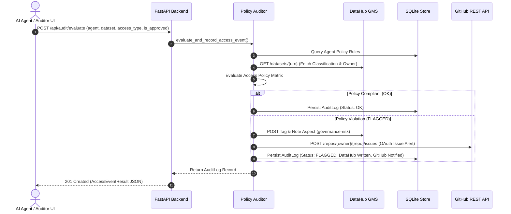

# Architecture & Data Flow Specification

## 1. System Component Overview

```
 ┌───────────────────────────────────────────────────────────┐
 │                   Frontend (React 18 + TS)                │
 │   Dashboard · Datasets · Agents · AuditRunner · AuditLog  │
 └─────────────────────────────┬─────────────────────────────┘
                               │ REST / JSON (JWT Bearer Auth)
 ┌─────────────────────────────▼─────────────────────────────┐
 │                    Backend API (FastAPI)                   │
 │   routers: auth, datasets, agents, audit, health          │
 └──────────────┬──────────────────────────────┬─────────────┘
                │                              │
 ┌──────────────▼──────────────┐ ┌──────────────▼─────────────┐
 │       Core Audit Engine     │ │      Database Store        │
 │ (auditor.py, policy.py)     │ │   (SQLite via SQLAlchemy)  │
 └──────────────┬──────────────┘ └────────────────────────────┘
                │
 ┌──────────────▼──────────────┐
 │    Integrations Layer       │
 └──────┬──────────────┬───────┘
        │              │
 DataHub REST SDK   GitHub REST API
        │              │
 ┌──────▼──────┐ ┌─────▼──────┐
 │   DataHub   │ │   GitHub   │
 │   (GMS)     │ │ (Issues)   │
 └─────────────┘ └────────────┘
```

---

## 2. Layering & Module Organization

- `backend/app/api/`: FastAPI REST endpoints, request/response validation, dependency injection.
  - `auth.py`: Authentication, registration, JWT tokens, and GitHub OAuth callback routes.
  - `datasets.py`: Catalog queries, classification tag editor, and DataHub risk tag remediation.
  - `agents.py`: AI agent policy registry CRUD routes.
  - `audit.py`: Access event evaluation, scenario simulator, audit log filtering, metrics, and CSV/JSON exports.
  - `health.py`: Live DataHub connection health check.
- `backend/app/core/`: Business domain logic, completely isolated from HTTP frameworks.
  - `policy.py`: Policy evaluation logic comparing agent permissions against dataset classifications.
  - `auditor.py`: Audit orchestration executing policy checks, persisting logs, and triggering write-backs.
  - `schemas.py`: Pydantic data schemas.
- `backend/app/store/`: Database persistence layer.
  - `models.py`: SQLAlchemy ORM models (`UserModel`, `AgentModel`, `AuditLogModel`).
  - `database.py`: SQLite session management and schema initialization (`auditor.db`).
- `backend/app/integrations/`: Integration wrappers.
  - `datahub_client.py`: DataHub REST/GMS client for metadata reads, `governance-risk` tag emission, and remediation tag clearance.
  - `github_client.py`: GitHub OAuth flow helper & REST API client for posting automated Issue alerts.
- `frontend/src/`: React frontend client application.
  - `pages/`: Dashboard, Datasets, Agents, AuditRunner, AuditLog, Settings, Login, Signup.
  - `components/`: Layout (Sidebar, DataHubBanner), AgentModal, DatasetDetailModal, AuditLogDetailModal, ProtectedRoute.
  - `services/api.ts`: API service layer.

---

## 3. End-to-End Evaluation & Write-Back Sequence



---

## 4. Complete REST API Matrix

| Endpoint | Method | Scope | Description |
| :--- | :--- | :--- | :--- |
| `/api/health` | `GET` | Public | System and DataHub GMS connection status |
| `/api/auth/signup` | `POST` | Public | Register new governance officer account |
| `/api/auth/login` | `POST` | Public | Authenticate user & issue JWT Bearer token |
| `/api/auth/me` | `GET` | Protected | Fetch current user session details |
| `/api/auth/github/url` | `GET` | Public | Generate GitHub OAuth redirect URL |
| `/api/auth/github/callback` | `POST` | Protected | Exchange code & link GitHub account |
| `/api/datasets` | `GET` | Public | List DataHub datasets with filters & sorting |
| `/api/datasets/{identifier}` | `GET` | Public | Fetch dataset details, tags, and audit notes |
| `/api/datasets/{identifier}/classification` | `POST` | Protected | Edit DataHub classification level tag |
| `/api/datasets/{identifier}/remediate` | `POST` | Protected | Clear DataHub `governance-risk` tag |
| `/api/agents` | `GET` / `POST` | Mixed | List registered agents / Register new agent |
| `/api/agents/{id}` | `PUT` / `DELETE` | Protected | Update or delete agent policy configuration |
| `/api/audit/evaluate` | `POST` | Public | Evaluate AI access event & execute write-backs |
| `/api/audit/simulate-batch` | `POST` | Public | Execute 5 pre-configured test scenarios |
| `/api/audit/logs` | `GET` | Public | Filtered audit logs with pagination |
| `/api/audit/metrics` | `GET` | Public | KPI compliance summary statistics |
| `/api/audit/export/csv` | `GET` | Public | Download audit trail report as CSV file |
| `/api/audit/export/json` | `GET` | Public | Download audit trail report as JSON file |
